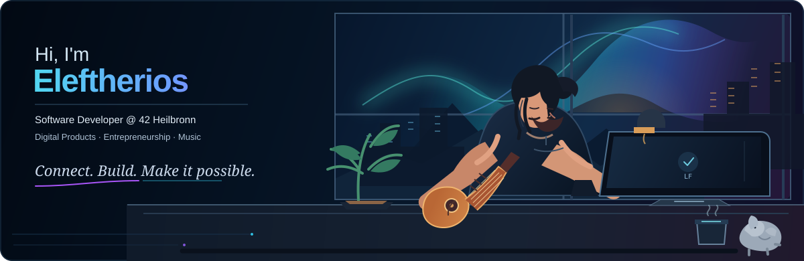
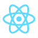
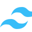
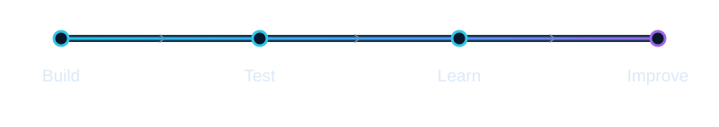
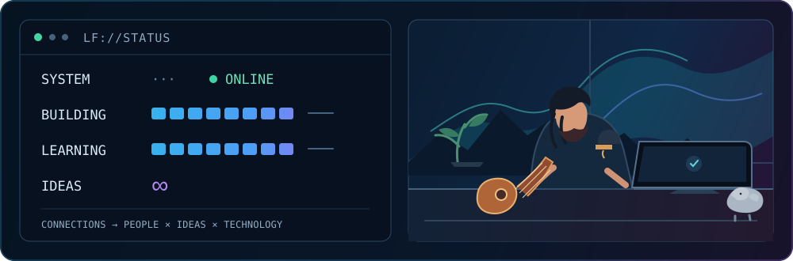

<p align="center">
  
</p>

<div align="center">

# Hi, I'm Eleftherios Kypraios 👋

### Software Developer @ 42 Heilbronn

Digital Products · Entrepreneurship · Music

**Connect. Build. Make it possible.**

</div>

---

## What I'm building

<table>
  <tr>
    <td width="33%" valign="top">
      <h3>LF DIGITAL AGENCY</h3>
      <p><strong>Ideas × Technology × People</strong></p>
      <p>Digital solutions for modern businesses.</p>
    </td>
    <td width="33%" valign="top">
      <h3>iSYNQ</h3>
      <p>Building better digital experiences for events.</p>
    </td>
    <td width="33%" valign="top">
      <h3><a href="https://github.com/LF-hub42/42-Heilbronn-Coding-School">42 Heilbronn</a></h3>
      <p>Learning by building, breaking and understanding.</p>
    </td>
  </tr>
</table>

---

## Tech Stack

<table>
  <tr>
    <td align="center"><br>C</td>
    <td align="center"><br>Python</td>
    <td align="center"><br>TypeScript</td>
    <td align="center"><br>React</td>
  </tr>
  <tr>
    <td align="center"><br>Next.js</td>
    <td align="center"><br>Tailwind CSS</td>
    <td align="center"><br>Supabase</td>
    <td align="center"><br>Git</td>
  </tr>
</table>

---

## LF LAB

> Experiments, prototypes and ideas in progress.

<p align="center">
  
</p>

---

## LF://STATUS

<p align="center">
  
</p>

*Decorative indicators, not measured progress.*

```text
SYSTEM       ONLINE
BUILDING     iterate · iterate · iterate (decorative)
LEARNING     observe · understand · repeat (decorative)
IDEAS        ∞

CONNECTIONS  → PEOPLE × IDEAS × TECHNOLOGY
```

---

## GitHub Stats & Activity

[Browse public repositories](https://github.com/LF-hub42?tab=repositories) · [View contribution activity](https://github.com/LF-hub42)

GitHub provides the live repository list and contribution graph on the profile. No mirrored or estimated counts are shown here.

---

<div align="center">

*Somewhere between code, commits and guitar strings. 🎸*

</div>
